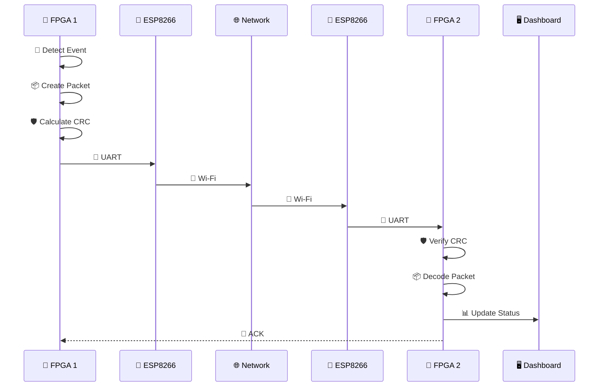
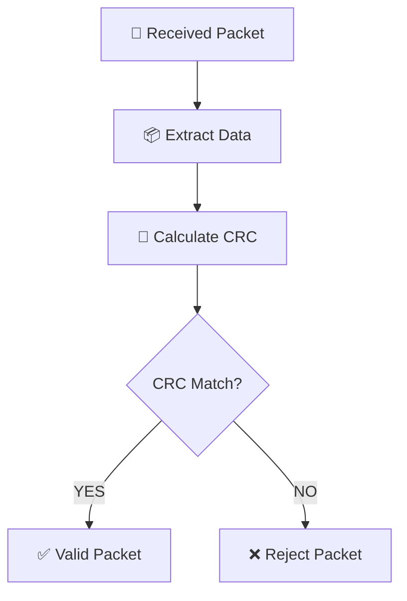
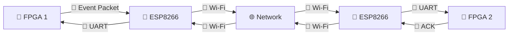

# ⚡ FPGA-Based Real-Time Industrial Control over Wireless Networks

> **A hardware-in-the-loop communication platform combining FPGA-based real-time logic, UART, ESP8266 Wi-Fi networking, packet integrity verification, and a live monitoring dashboard.**

<p align="center">

**FPGA ⚙️ → UART 🔌 → ESP8266 📡 → Wi-Fi 🌐 → ESP8266 📡 → UART 🔌 → FPGA ⚙️**

</p>

---

## 🚀 What Is This Project?

This project explores how **FPGA-based real-time control systems can communicate over wireless networks** while maintaining a structured and reliable data path.

The current prototype uses:

```text
FPGA 1
   │
   │ UART
   ▼
ESP8266
   │
   │ Wi-Fi
   ▼
Wireless / PC Network
   │
   │ Wi-Fi
   ▼
ESP8266
   │
   │ UART
   ▼
FPGA 2
```

The FPGA handles the **real-time control and communication logic**, while the ESP8266 acts as the **wireless networking interface**.

### 🧩 Current Technology

| Layer               | Technology         |
| ------------------- | ------------------ |
| 🧠 Processing       | Spartan-7 FPGA     |
| 🔌 FPGA ↔ Wireless  | UART               |
| 📡 Wireless         | ESP8266 Wi-Fi      |
| 🛡️ Error Detection | CRC-16/CCITT-FALSE |
| 🔄 Communication    | Bidirectional      |
| 🖥️ Monitoring      | PC Dashboard       |
| ⚡ FPGA Clock        | 100 MHz            |
| 📶 UART             | 115200 baud        |

### 🔮 Future Direction

The architecture is designed to evolve toward:

**Wi-Fi baseline → 5G communication → real-time industrial-control evaluation**

> ⚠️ **5G is a planned extension. It is not part of the current implementation.**

---

# 🏗️ Interactive System Architecture

The complete system can be viewed in three layers:

```mermaid
flowchart LR

    A["🧠 FPGA 1<br/>Real-Time Control"]
    B["📦 Packet Generator<br/>Event + Vehicle ID"]
    C["🛡️ CRC Generator"]
    D["🔌 UART TX"]
    E["📡 ESP8266<br/>Wi-Fi Interface"]
    F["🌐 Wireless Network"]
    G["📡 ESP8266<br/>Wi-Fi Interface"]
    H["🔌 UART RX"]
    I["🛡️ CRC Checker"]
    J["📦 Packet Decoder"]
    K["🧠 FPGA 2<br/>Event Processing"]

    A --> B
    B --> C
    C --> D
    D --> E
    E --> F
    F --> G
    G --> H
    H --> I
    I --> J
    J --> K

    K -. "↩️ ACK" .-> J
```



### 🔍 Click to Explore

<details>
<summary>🧠 <b>FPGA Layer</b></summary>

The FPGA is responsible for the real-time portion of the system.

It handles:

* Event generation
* Packet formation
* CRC generation
* UART transmission
* UART reception
* CRC verification
* Packet decoding
* ACK generation
* Hardware status indication

The wireless module does **not** perform the core control logic.

</details>

<details>
<summary>📡 <b>Wireless Layer</b></summary>

The ESP8266 provides the network connectivity.

Its job is intentionally simple:

```text
UART Data
    ↓
ESP8266
    ↓
Wi-Fi
    ↓
Network
    ↓
ESP8266
    ↓
UART Data
```

This separation allows the wireless technology to be changed later without completely redesigning the FPGA communication layer.

</details>

<details>
<summary>🖥️ <b>Monitoring Layer</b></summary>

The PC dashboard provides a higher-level view of the system.

It can display:

* 📦 Packets
* ✅ CRC Passed
* 🚨 Last Event
* 🔗 Connection Status
* 🔄 Communication activity

Meanwhile, LEDs and the 7-segment display provide low-level hardware feedback directly on the FPGA boards.

</details>

---

# 🔄 How One Packet Travels

Suppose **FPGA 1 detects an emergency event**.

The data path becomes:



This gives the project a clear **end-to-end communication path** rather than treating each module as an isolated experiment.

---

# 📦 Packet Structure

The communication protocol uses a structured frame:

```text
┌──────┬────────────┬────────┬────────┬────────┬──────┬──────┐
│  A5  │ EVENT/TYPE │ VEH_H  │ VEH_L  │  CRC   │  5A  │  0A  │
│ 8-bit│   8-bit    │ 8-bit  │ 8-bit  │ 16-bit │ 8-bit│ 8-bit│
└──────┴────────────┴────────┴────────┴────────┴──────┴──────┘
```

### 🧩 Packet Fields

| Field        | Bits | Description             |
| ------------ | ---: | ----------------------- |
| `A5`         |    8 | 🚩 Start-of-frame       |
| `EVENT/TYPE` |    8 | 🚨 Event type           |
| `VEH_H`      |    8 | 🚗 Vehicle ID high byte |
| `VEH_L`      |    8 | 🚗 Vehicle ID low byte  |
| `CRC_H`      |    8 | 🛡️ CRC high byte       |
| `CRC_L`      |    8 | 🛡️ CRC low byte        |
| `5A`         |    8 | 🏁 End marker           |
| `0A`         |    8 | 🔚 Frame termination    |

CRC is calculated over:

```text
A5 | EVENT/TYPE | VEH_H | VEH_L
```

---

# 🛡️ CRC Verification

The receiver does not blindly trust the incoming packet.

Instead:



### CRC Configuration

```text
Algorithm : CRC-16/CCITT-FALSE
Polynomial: 0x1021
Initial   : 0xFFFF
```

This provides an error-detection mechanism for corrupted packets.

---

# 🔄 Bidirectional Communication

The system supports communication in both directions.



This enables the system to support an event → acknowledgement workflow.

---

# 🔬 Performance Testing

The goal is not only to prove:

> **"The packet arrived."**

The system can be used to measure actual communication characteristics.

### 📦 Packet Loss

```text
Packets Sent    = N
Packets Received = M

Packet Loss = N - M
```

Percentage:

```text
Loss (%) = ((N - M) / N) × 100
```

### ⏱️ Latency

Measure the time between:

```text
🚨 Event Generated
       ↓
📦 Packet Created
       ↓
📡 Wireless Transmission
       ↓
📥 Packet Received
       ↓
🧠 Packet Processed
```

### 📈 Jitter

Repeated latency measurements can reveal variation:

```text
Packet 1 → 12 ms
Packet 2 → 14 ms
Packet 3 → 11 ms
Packet 4 → 20 ms
Packet 5 → 13 ms
```

### 🔄 ACK Response

The acknowledgement path can be measured as:

```text
FPGA 1
  │
  │ Event
  ▼
FPGA 2
  │
  │ ACK
  ▼
FPGA 1
```

This provides a way to evaluate round-trip response time.

---

# 🧪 Current Implementation Status

| Feature                        | Status         |
| ------------------------------ | -------------- |
| 🧠 FPGA RTL                    | ✅ Implemented  |
| 🔌 UART Communication          | ✅ Implemented  |
| 📦 Packet Generation           | ✅ Implemented  |
| 🛡️ CRC Generation             | ✅ Implemented  |
| 🛡️ CRC Verification           | ✅ Implemented  |
| 🔄 Bidirectional Communication | ✅ Implemented  |
| 📡 ESP8266 Wi-Fi               | ✅ Implemented  |
| 🖥️ Dashboard                  | ✅ Implemented  |
| 📊 Performance Measurement     | 🔄 In Progress |
| ⏱️ Latency Characterization    | 🔄 In Progress |
| 📉 Packet-Loss Testing         | 🔄 In Progress |
| 📶 5G Integration              | 🔮 Future      |

---

# 🧰 Hardware Stack

### 🧠 FPGA

**RealDigital Boolean Board**

Based on an AMD/Xilinx Spartan-7 FPGA.

Used for:

* Real-time logic
* Packet processing
* UART
* CRC
* Event handling
* Hardware debugging

### 📡 ESP8266

Used as the wireless networking interface.

### 💻 PC

Used for:

* Wireless/network bridging
* Communication monitoring
* Dashboard
* Performance analysis

---

# 🗂️ Repository Structure

```text
📁 project-root/
│
├── 📁 rtl/
│   ├── roadsos_top.sv
│   ├── uart_tx.sv
│   ├── uart_rx.sv
│   ├── packet_generator.sv
│   ├── packet_decoder.sv
│   ├── crc_generator.sv
│   ├── crc_checker.sv
│   └── ack_controller.sv
│
├── 📁 constraints/
│   ├── fpga1.xdc
│   └── fpga2.xdc
│
├── 📁 esp8266/
│   ├── transmitter/
│   └── receiver/
│
├── 📁 dashboard/
│   ├── frontend/
│   └── backend/
│
├── 📁 simulation/
│   └── testbenches/
│
├── 📁 docs/
│   ├── architecture.md
│   ├── protocol.md
│   └── testing.md
│
└── 📄 README.md
```

---

# 🔮 Future: 5G Extension

The current Wi-Fi system establishes the baseline.

The planned architecture is:


The objective is to experimentally compare wireless communication technologies.

Potential metrics:

| Metric           | Wi-Fi Baseline | Future 5G |
| ---------------- | -------------- | --------- |
| ⏱️ Latency       | Measure        | Measure   |
| 📈 Jitter        | Measure        | Measure   |
| 📦 Packet Loss   | Measure        | Measure   |
| 🚀 Throughput    | Measure        | Measure   |
| 🔄 Response Time | Measure        | Measure   |
| 🔗 Reliability   | Measure        | Measure   |

The FPGA control and packet-processing layers can remain largely unchanged while the communication layer evolves.

---

# 🎯 Project Roadmap

```text
                     PROJECT ROADMAP

        ┌──────────────────────────────┐
        │ 1️⃣ FPGA Communication       │
        │        ✅ DONE               │
        └──────────────┬───────────────┘
                       │
                       ▼
        ┌──────────────────────────────┐
        │ 2️⃣ UART + Packet Protocol   │
        │        ✅ DONE               │
        └──────────────┬───────────────┘
                       │
                       ▼
        ┌──────────────────────────────┐
        │ 3️⃣ CRC + Error Detection    │
        │        ✅ DONE               │
        └──────────────┬───────────────┘
                       │
                       ▼
        ┌──────────────────────────────┐
        │ 4️⃣ ESP8266 + Wi-Fi          │
        │        ✅ DONE               │
        └──────────────┬───────────────┘
                       │
                       ▼
        ┌──────────────────────────────┐
        │ 5️⃣ Bidirectional Link       │
        │        ✅ DONE               │
        └──────────────┬───────────────┘
                       │
                       ▼
        ┌──────────────────────────────┐
        │ 6️⃣ Performance Analysis     │
        │        🔄 CURRENT             │
        └──────────────┬───────────────┘
                       │
                       ▼
        ┌──────────────────────────────┐
        │ 7️⃣ 5G Integration           │
        │        🔮 FUTURE              │
        └──────────────┬───────────────┘
                       │
                       ▼
        ┌──────────────────────────────┐
        │ 8️⃣ Real-Time Control Demo   │
        │        🔮 FUTURE              │
        └──────────────────────────────┘
```

---

# 💡 Why This Architecture?

The key idea is **modularity**.

```text
             APPLICATION
                  │
                  ▼
        ┌───────────────────┐
        │   FPGA CONTROL    │
        └─────────┬─────────┘
                  │
                  ▼
        ┌───────────────────┐
        │ PACKET + CRC LAYER│
        └─────────┬─────────┘
                  │
                  ▼
        ┌───────────────────┐
        │ COMMUNICATION I/F │
        └─────────┬─────────┘
                  │
          ┌───────┴───────┐
          ▼               ▼
       📡 Wi-Fi          📶 5G
       CURRENT           FUTURE
```

The FPGA does not need to fundamentally change just because the wireless technology changes.

That makes the platform suitable for **comparative communication experiments**.

---

# 🏁 Final Objective

The project is being developed in stages:

**FPGA Communication**

⬇️

**UART-Based Packet Transfer**

⬇️

**CRC-Protected Communication**

⬇️

**ESP8266 Wi-Fi Networking**

⬇️

**Bidirectional Wireless Communication**

⬇️

**Performance Characterization**

⬇️

**5G Integration**

⬇️

**Real-Time Industrial Control Evaluation**

---

## 📌 Current Status

> **🟢 Prototype Stage — FPGA + UART + ESP8266 Wi-Fi communication implemented**
>
> **🔵 Next Stage — quantitative latency, jitter and packet-loss evaluation**
>
> **🟣 Long-Term — 5G integration and real-time industrial-control experiments**

---

### 👨‍💻 Built as a hardware-in-the-loop platform for exploring FPGA-based real-time communication.

**FPGA ⚡ | UART 🔌 | Wi-Fi 📡 | CRC 🛡️ | 5G 🔮 | Industrial Control 🏭**
