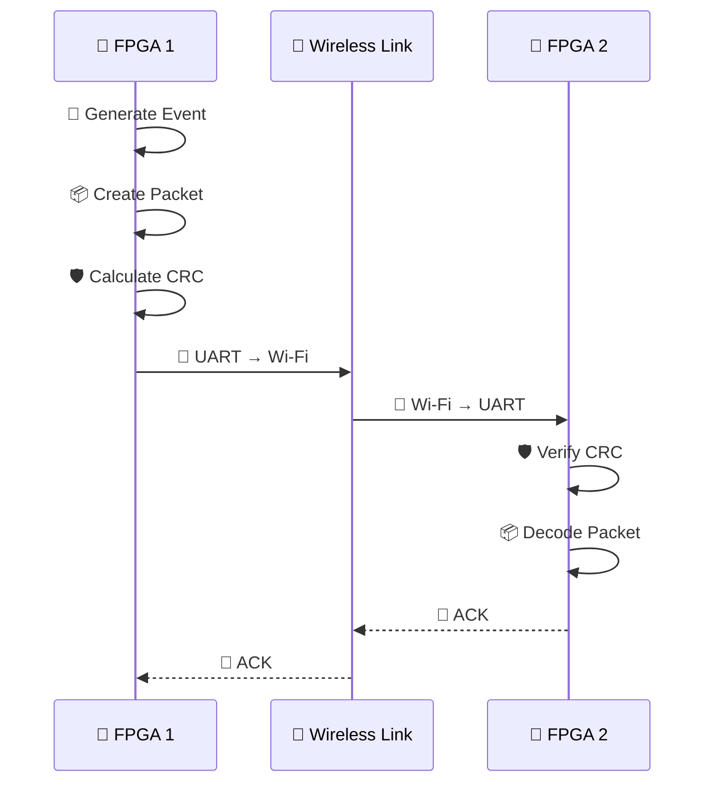

# ⚡ FPGA-Based Real-Time Industrial Control over Wireless Networks

> A hardware-in-the-loop platform for **real-time FPGA communication over wireless networks**, using UART, ESP8266 Wi-Fi, CRC-based error detection, and bidirectional communication.

### 🚀 Current Setup

**FPGA 1 → UART → ESP8266 → Wi-Fi → ESP8266 → UART → FPGA 2**

**Current:** 📡 Wi-Fi
**Future:** 📶 5G integration

> ⚠️ 5G is planned as a future extension; the current prototype uses ESP8266 Wi-Fi.

---

## 🏗️ Architecture


<details>
<summary>🔍 <b>What does each block do?</b></summary>

**🧠 FPGA**
Handles event generation, packet processing, CRC verification, UART and acknowledgement logic.

**📡 ESP8266**
Acts as the wireless communication interface.

**🌐 Network**
Transfers packets between the two endpoints.

**🖥️ Dashboard**
Provides real-time monitoring of packets, events and communication status.

</details>

---

## 📦 Packet Format

```text
A5 | EVENT | VEHICLE ID | CRC | 5A | 0A
```

| Field        | Purpose                  |
| ------------ | ------------------------ |
| `A5`         | 🚩 Start                 |
| `EVENT`      | 🚨 Event type            |
| `VEHICLE ID` | 🚗 Device identification |
| `CRC`        | 🛡️ Error detection      |
| `5A 0A`      | 🏁 Frame termination     |

### 🛡️ CRC

**CRC-16/CCITT-FALSE**

```text
Polynomial : 0x1021
Initial    : 0xFFFF
UART       : 115200 baud
```

---

## 🔄 Communication Flow



---

## 🧰 Hardware & Software

| Component           | Technology                      |
| ------------------- | ------------------------------- |
| 🧠 FPGA             | Spartan-7 / RealDigital Boolean |
| 📡 Wireless         | ESP8266                         |
| 🔌 Serial           | UART                            |
| 🛡️ Error Detection | CRC-16                          |
| 💻 Monitoring       | PC Dashboard                    |
| 🛠️ HDL             | SystemVerilog                   |
| 🔧 FPGA Tool        | Vivado                          |

---

## 📊 Testing

The system is being evaluated using:

* ⏱️ End-to-end latency
* 📦 Packet loss
* 📈 Jitter
* 🔄 ACK response time
* 🛡️ CRC error detection

---

## 🔮 Roadmap

```text
FPGA Communication       ✅
        ↓
UART + Packet Protocol   ✅
        ↓
CRC Verification         ✅
        ↓
ESP8266 + Wi-Fi          ✅
        ↓
Bidirectional Link       ✅
        ↓
Performance Testing      🔄
        ↓
5G Integration           🔮
        ↓
Industrial Control Demo  🔮
```

---

## 🎯 Goal

Build a modular platform where the **FPGA handles real-time control and packet processing**, while the wireless layer can evolve from **Wi-Fi → 5G** without redesigning the entire system.

**FPGA ⚡ | UART 🔌 | Wi-Fi 📡 | CRC 🛡️ | 5G 🔮**
